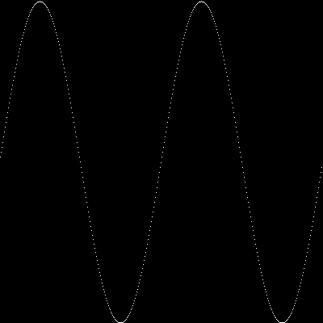

# Activitat d'imatges i llibreries per AP2

Aquesta activitat mostra com baixar una llibreria de codi obert
per a crear senzillament imatges en C++, com instal·lar-la i com usar-la.

S'ha comprovat que els passos donats funcionin correctament als
ordinadors de la FIB. Falta comprovar-ho a la FME. En Mac OS també
funcionen. Per altres sistemes potser haureu d'instal·lar alguna
dependència suplementària.


## Guió de l'activitat

1.  Aneu en algun directori temporal i baixeu-hi la llibreria
    [pngwriter](https://github.com/pngwriter/pngwriter):

    ```bash
    git clone https://github.com/pngwriter/pngwriter.git
    ```

1.  Compileu la llibreria:

    ```bash
    # entreu al repositori amb el codi font de la llibreria que heu baixat
    cd pngwriter

    # prepareu la compilació amb algunes opcions
    cmake -DPNGwriter_USE_FREETYPE=OFF -DCMAKE_INSTALL_PREFIX=$HOME/libs

    # compileu la llibreria
    make

    # instal·leu la llibreria
    make install
    ```

    A la instrucció `cmake`, el flag `-DPNGwriter_USE_FREETYPE=OFF` inhibeix
    l'ús de les llibreries FreeType (que potser no teniu instal·lades
    i no necessitem). El flag `-DCMAKE_INSTALL_PREFIX=$HOME/libs` indica a on
    s'instal·larà la llibreria (en aquest cas, al directori `libs` sota el vostre
    directori principal, referit per la variable d'entorn `$HOME`).

    Un cop compilada i instal·lada la llibreria, examineu els directoris
    `include` i `lib` dins de `$HOME/libs`.


1.  Ara provareu la llibreria.
    Aneu en algun directori temporal i baixeu aquesta activitat.

    ```bash
    git clone https://github.com/jordi-petit/ap2-imatges.git
    ```

1.  Compileu el [programa de prova](prova.cc):

    ```bash
    # entreu al repositori amb l'activitat que heu baixat
    cd ap2-imatges

    # mireu el programa prova.cc
    cat prova.cc

    # compileu el programa prova.cc
    g++ -Wall -std=c++11 -O2 -DNO_FREETYPE -I $HOME/libs/include prova.cc -L $HOME/libs/lib -l PNGwriter -l png -o prova.x

    # executeu el programa
    ./prova.x

    # mireu el fitxer prova.png amb algun visor d'imatges
    ```

    El programa hauria de produir aquesta imatge (`prova.png`):

    

    Fixeu-vos que per compilar el programa:

    - S'indica que no es vol usar la lliberia FreeType.
    - S'indica amb el `-I` en quin directori cal buscar els *includes*.
    - S'indica amb el `-L` en quin directori cal buscar les llibreries.
    - S'indica amb el `-l` amb quines llibreries cal enllaçar (la primera
      és la que acabem de baixar, la segona és estàndard).

1.  Creu un `Makefile` per compilar amb `make` i esborrar l'executable amb `make clean`.

1.  Consulteu la [documentació de pngwriter](http://pngwriter.sourceforge.net/)
per fer que el programa pinti quelcom interessant utilitzant diferentes
formes com ara punts, línies i cercles de diferents colors. Sigueu creatius!


