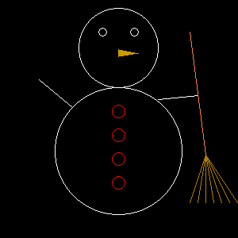

# Activitat d'imatges i llibreries per AP2

Aquesta activitat mostra com baixar una llibreria de codi obert
per a crear senzillament imatges en C++, com instal·lar-la i com usar-la.

S'ha comprovat que els passos donats funcionin correctament als
ordinadors de la FIB. En Mac OS també
funcionen. Per altres sistemes potser haureu d'instal·lar alguna
dependència suplementària. Mireu l'apèndix final.


## Guió de l'activitat

1.  Aneu en algun directori temporal i baixeu-hi la llibreria
    [pngwriter](https://github.com/pngwriter/pngwriter):

    ```bash
    git clone https://github.com/pngwriter/pngwriter.git
    ```

1.  Compileu la llibreria:

    ```bash
    # entreu al repositori amb el codi font de la llibreria que heu baixat
    cd pngwriter

    # prepareu la compilació amb algunes opcions
    cmake -DPNGwriter_USE_FREETYPE=OFF -DCMAKE_INSTALL_PREFIX=$HOME/libs .

    # compileu la llibreria
    make

    # instal·leu la llibreria
    make install
    ```

    A la instrucció `cmake`, el flag `-DPNGwriter_USE_FREETYPE=OFF` inhibeix
    l'ús de les llibreries FreeType (que potser no teniu instal·lades
    i no necessitem). El flag `-DCMAKE_INSTALL_PREFIX=$HOME/libs` indica a on
    s'instal·larà la llibreria (en aquest cas, al directori `libs` sota el vostre
    directori principal, referit per la variable d'entorn `$HOME`).

    Un cop compilada i instal·lada la llibreria, el seu codi ja no us cal
    (perquè el teniu ja en forma de llibreria a `$HOME/libs`). Per tant,
    podeu esborrar-la:

    ```bash
    cd ..
    rm -rf pngwriter
    ```
    Als directoris
    `include` i `lib` dins de `$HOME/libs` veureu el que ha quedat instal·lat
    (això no ho hauríeu d'esborrar).


1.  Ara provareu la llibreria.
    Aneu en algun directori temporal i baixeu-hi aquesta activitat.

    ```bash
    git clone https://github.com/jordi-petit/ap2-imatges.git
    ```

1.  Examineu el programa de prova:

    ```bash
    # entreu al repositori amb l'activitat que heu baixat
    cd ap2-imatges

    # mireu el programa prova.cc
    cat prova.cc
    ```

    El programa pinta una corba sinusoïdal blanca en un fitxer `prova.png`
    de 400×400 pixels amb fons negre utilitzant un objecte `png`:

    ```c++
    #include <pngwriter.h>

    #include <cmath>
    using namespace std;

    int main() {
        const int size = 400;
        // create a png variable that denotes a size×size black canvas named "prova.png"
        pngwriter png(size, size, 0, "prova.png");
        for (int x = 0; x < size; x++) {
            int y = size/2 + (size/2-1) * sin(x / double(size) * 4 * M_PI);
            // plot a pixel at x,y coordinates with RGB=1,1,1 (white)
            png.plot(x, y, 1.0, 1.0, 1.0);
        }
        // write the png
        png.close();
    }
    ```


1.  Compileu el programa de prova:

    ```bash
    # compileu el programa prova.cc
    g++ -Wall -std=c++11 -O2 -DNO_FREETYPE -I $HOME/libs/include prova.cc -L $HOME/libs/lib -l PNGwriter -l png -o prova.x

    # executeu el programa
    ./prova.x

    # mireu el fitxer prova.png amb algun visor d'imatges
    ```

    El programa hauria de produir aquesta imatge al fitxer `prova.png`:

    

    Podeu visualitzar el fitxer `prova.png` amb `open resultat.png` en Mac o
    `display resultat.png` en Linux (o qualsevol altra comanda per visualitzar
    imatges).

    Fixeu-vos que per compilar el programa:

    - S'indiquen els flags habituals.
    - S'indica que no es vol usar la lliberia FreeType (no ens cal).
    - S'indica amb el `-I` en quin directori cal buscar els *includes*.
    - S'indica amb el `-L` en quin directori cal buscar les llibreries.
    - S'indica amb el `-l` amb quines llibreries cal enllaçar (la primera
      és la que acabem de baixar, la segona és estàndard).

1.  Creu un `Makefile` per compilar amb `make` i esborrar l'executable amb `make clean`.

    Compte: Als makefiles, les variables han d'anar entre parèntesis i amb dòlars: `$(HOME)`.

1.  Consulteu [la documentació de pngwriter](http://pngwriter.sourceforge.net/manual-en.php)
    per fer que el programa pinti quelcom interessant utilitzant diferentes
    formes com ara punts, línies i cercles de diferents colors.
    Per exemple, podeu dibuixar un ninot de neu, un histograma o un fractal...
    Sigueu creatius!

    Per exemple, la Mireia ha fet això:

    

1.  Pengeu les vostres creacions al [google drive](https://drive.google.com/drive/folders/1Z9tHIDCQigO-j4PXq9C3disgJywKlvEC?usp=sharing).
    La millor imatge guanyarà un fabulós premi!


# Apèndix

## Eines a la FME

Malauradament, el `cmake` no està instal·lat als ordinadors en Linux de la FME.
Us heu de baixar [aquest paquet](https://github.com/Kitware/CMake/releases/download/v3.12.4/cmake-3.12.4-Linux-x86_64.tar.gz)
i descomprimir-lo en algun directori, diguem-ne `DIR`. Llavors,
la comanda `cmake` la escriviu com a `$DIR/bin/cmake`:

```bash
# $DIR és el directori on heu descomprimit el paquet del cmake
$DIR/bin/cmake -DPNGwriter_USE_FREETYPE=OFF -DCMAKE_INSTALL_PREFIX=$HOME/libs .
```

Un cop fet, ja no us cal més el `cmake`.


## Eines en Mac

Sembla que en Mac potser cal que us instal·leu els
paquets `cmake` i `libpng`. Recomanem que utilitzeu
el gestor de paquets [brew](https://brew.sh/index_ca)
si no el teniu encara:

```bash
# instal·la brew
/usr/bin/ruby -e "$(curl -fsSL https://raw.githubusercontent.com/Homebrew/install/master/install)"

# instal·la cmake i libpng
brew install cmake libpng
```

## Eines en Ubuntu

Sembla que en Ubuntu potser cal que us instal·leu aquests paquets:

```bash
sudo apt install cmake libpng16-tools libpng16-devtools 
```

## Eines en Windows

Eign?
https://es.wikipedia.org/wiki/Suicidio
